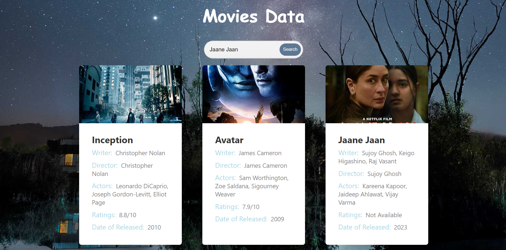

# Movie Data Rendering

This project is a movie data rendering application that showcases strong frontend skills and API integration. It offers users a seamless experience to explore and discover movies. It's built using HTML, CSS, and JavaScript.



## Table of Contents

- [Features](#features)
- [Technologies Used](#technologies-used)
- [Usage](#usage)
- [Contributing](#contributing)
- [Credits](#Credits)

## Features

- Real-time movie data rendering.
- User-friendly interface for movie exploration.
- Seamless integration with movie databases.

## Technologies Used

- HTML
- CSS
- JavaScript

## Usage

1. Clone the repository to your local machine using Git:

   ```bash
   git clone https://github.com/yourusername/movie-data-rendering.git
   ```

2. Open the project directory.

3. Open the index.html file in your web browser to start using the application.

4. Explore and discover movies!

### Contributing

Contributions are welcome. If you'd like to contribute to this project, please follow these steps:

1. Fork the project.
2. Create your feature branch: git checkout -b YourFeature.
3. Commit your changes: git commit -m 'Add some feature'.
4. Push to the branch: git push origin YourFeature.
5. Create a new Pull Request.

### Credits

This project relies on data from a movie API. Special thanks to The Open Movies Database for making this project possible.

### Author

Partiksha Patil
