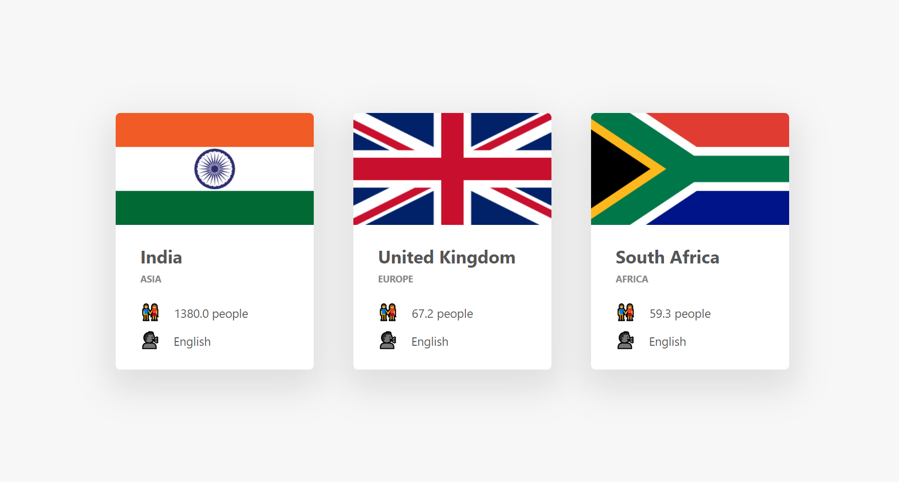

# GPS Coordinates-Based Country Rendering App

### Overview
The GPS Coordinates-Based Country Rendering App is a web application that allows users to dynamically render country information along with the respective flag based on GPS coordinates (longitude and latitude). This app is developed using HTML, CSS, and JavaScript, making it accessible and easy to use for anyone with a web browser.

### Features
1. Geolocation-Based Rendering: The app uses the provided GPS coordinates to determine the user's location and render country information accordingly.
2. Interactive User Interface: App will display the country's information and flag.
3. Informative Display: The app provides details about the country, including its name, flag, Populations, and Language.

### Technologies
This project is built with the following technologies:

1. HTML: Used for creating the structure and content of the web page.
2. CSS: Provides styles and layouts for an appealing user interface.
3. JavaScript: Enables interactive features and fetching country information based on GPS coordinates.

### Usage
1. Open the index.html file in a web browser.
2. The app will render the country's flag and relevant information as per the given values (longitude and latitude).

### Author
Partiksha Patil 
