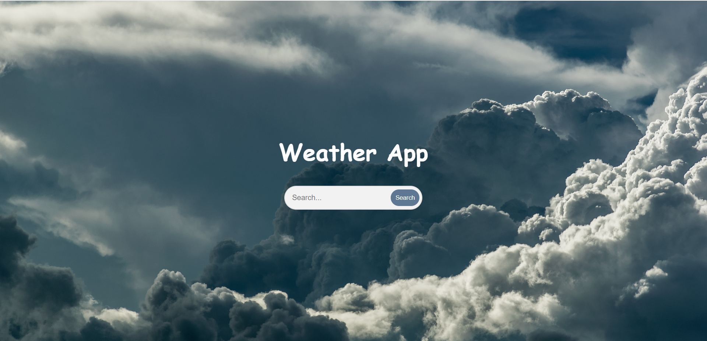
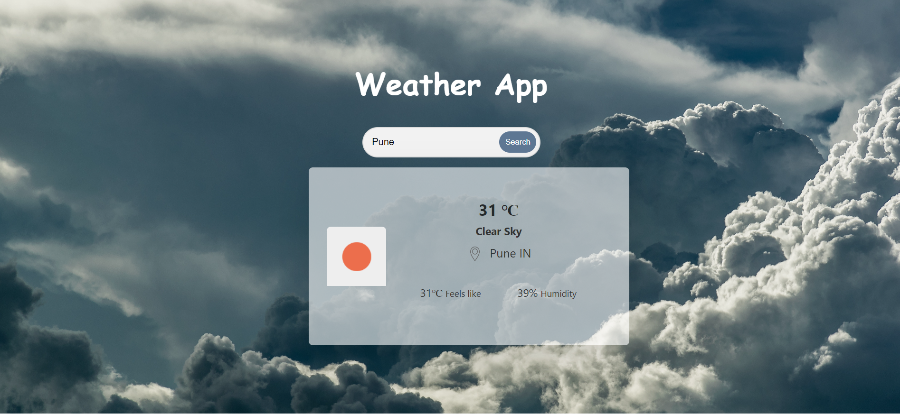

# Weather App

A simple Weather App that provides real-time weather information, including temperature, humidity, and forecasts with an attractive user interface.



## Table of Contents

- [Features](#features)
- [Demo](#demo)
- [Getting Started](#getting-started)
  - [Prerequisites](#prerequisites)
  - [Installation](#installation)
- [Usage](#usage)
- [Technologies Used](#technologies-used)
- [Contributing](#contributing)

## Features

- Real-time weather data
- Temperature, humidity, and forecasts
- Attractive user interface

## Demo



## Getting Started

### Prerequisites

Before you begin, ensure you have met the following requirements:

- You will need an API key from a weather data provider (e.g., [OpenWeatherMap](https://openweathermap.org/api)).

### Installation

1. Clone the repository:

   ```sh
   git clone git@github.com:pratikshasamane/javascript_programs.git
   ```

2. cd Weather App

### Usage

- To run this app, double click on index.html file inside folder.

### Technologies Used

- HTML
- CSS
- JavaScript

### Contributing

Contributions are welcome. If you'd like to contribute to this project, please follow these steps:

1. Fork the project.
2. Create your feature branch: git checkout -b YourFeature.
3. Commit your changes: git commit -m 'Add some feature'.
4. Push to the branch: git push origin YourFeature.
5. Create a new Pull Request.
